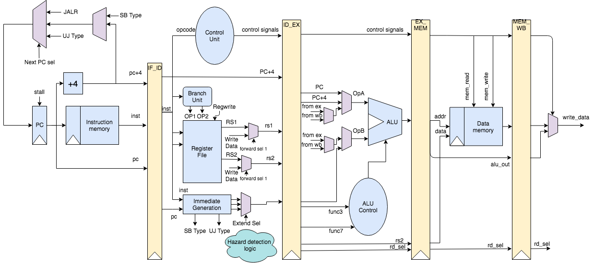

<h1 align='center'> Aurora-5-Stage-Pipelined-RV32i</h1>

<div align='center'><br>

</div>



First of all get started by Cloning this repository in your machine.
```ruby
git clone https://github.com/samadpls/Aurora-5-Stage-Pipelined-RV32i.git
```

Create a .txt file and place the ***hexadecimal*** code of your instructions simulated on ***Venus*** (RISC-V Simulator)\
Each instruction's hexadecimal code must be on seperate line as following.

For example instructions, Go to text.txt and copy code in the .txt file\

 You'll find test.asm file for the Assembly instructions for the purpose of checking.

Then perform the following step
```ruby
cd Aurora-5-Stage-Pipelined-RV32i/src/main/scala/datapath
```
Open **instmem.scala** with this command. You can also manually go into the above path and open the file in your favorite text editor.
```py
open instmem.scala
```
Find the following line

```py
loadMemoryFromFile(mem, "D:/5_stage_pipline/src/main/scala/datapath/text.txt")
```

Change the .txt file path to match your file that you created above storing your own program instructions.\
After setting up the InsMem.scala file, go inside the Ababeel folder.

```ruby
cd Aurora
```
And enter

```ruby
sbt
```
Aurora-5-Stage-Pipelined-RV32i
When the terminal changes to this type

```ruby
sbt:Aurora-5-Stage-Pipelined-RV32i>
```

Enter this command

```ruby
sbt:Aurora-5-Stage-Pipelined-RV32i> testOnly datapath.toptest  -- -DwriteVcd=1
```

After success you will get a folder ***test_run_dir*** on root of your folder. Go into the examples folder inside.\
There you will find the folder named Top. Enter in it and you can find the Top.vcd file which you visualise on **gtkwave**
